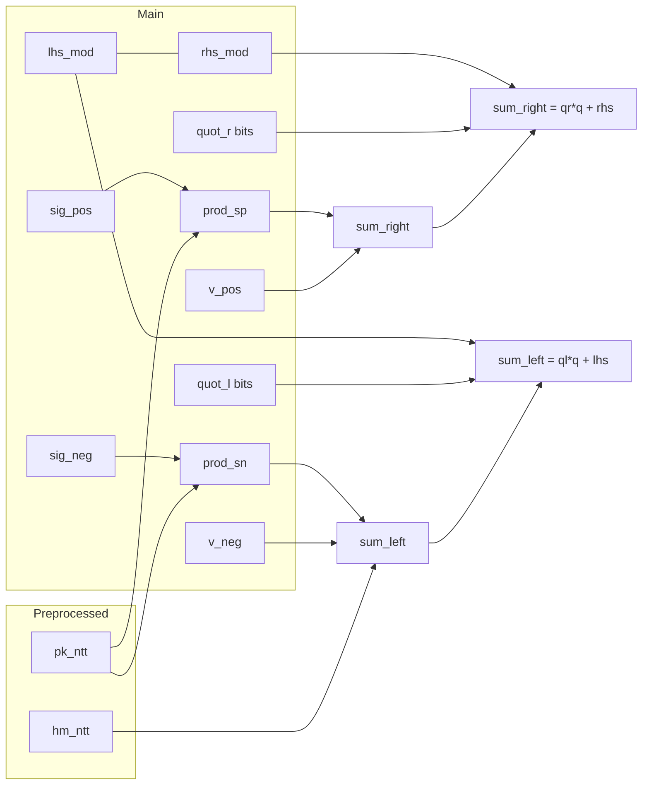
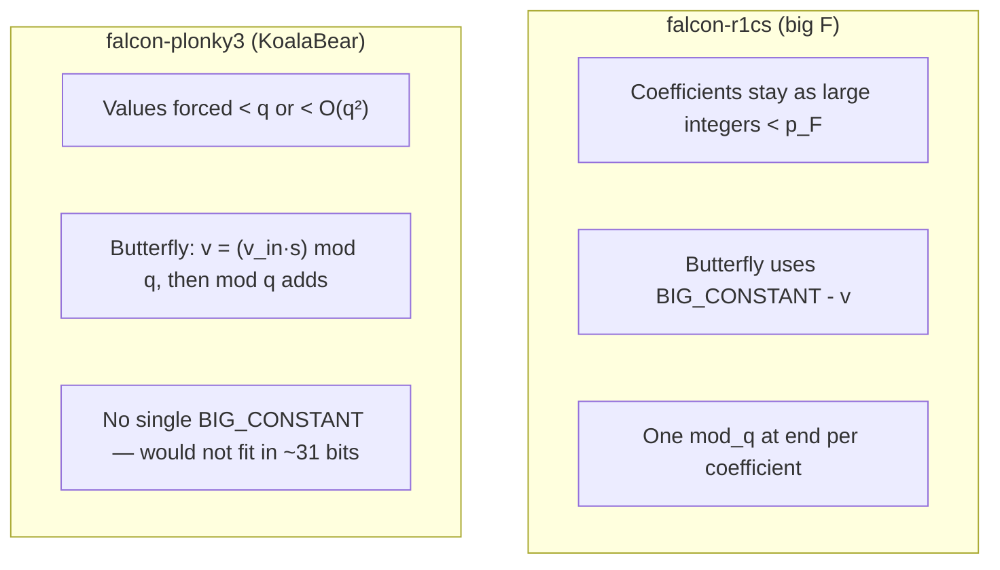

# falcon-plonky3

Plonky3 STARK scaffolding for Falcon signature verification (see [`falcon-rust`](../falcon-rust) for the lattice scheme and [`falcon-r1cs`](../falcon-r1cs/src/circuits/falcon_dual_ntt.rs) for the closest R1CS).

## Trace layout (per row)

Rows are indexed by NTT coefficient $i = 0 \ldots N-1$ (with $N = 512$ or $1024$). One row = one NTT index.

### Preprocessed trace (2 columns)

Committed once per statement; intended to correspond to **public** Falcon data (same role as `pk_ntt` / `hm_ntt` inputs in Groth16 examples).

| Col | Name     | Meaning |
|-----|----------|---------|
| 0   | `pk_ntt` | Public key polynomial in **NTT** form, coeff $i$ over $\mathbb{Z}_q$ |
| 1   | `hm_ntt` | Message-hash polynomial `hm` in **NTT** form, coeff $i$ |

### Main trace (36 columns)

Private witness per row. Coefficients are still **Falcon residues mod** `q = 12289`, embedded into KoalaBear for the STARK.

| Col(s) | Name | Meaning |
|--------|------|---------|
| 0–1 | `sig_pos_ntt`, `sig_neg_ntt` | Dual-limb NTT of signature polynomial (see dual path in [`verify_parsed_sig`](../falcon-rust/src/structs/pk.rs)) |
| 2–3 | `v_pos_ntt`, `v_neg_ntt` | Dual-limb NTT of $v = hm - s\cdot pk$ |
| 4–5 | `lhs_mod`, `rhs_mod` | Residues mod $q$ of the two sides of the dual-NTT congruence (must agree) |
| 6–7 | `prod_sig_pos_pk`, `prod_sig_neg_pk` | Integer products `sig_pos·pk` and `sig_neg·pk` (as integers $< q^2$), embedded in KoalaBear |
| 8–21 | `quot_l_bits[0..14]` | Little-endian bits of quotient `quot_l` in `sum_left = quot_l·q + lhs_mod` |
| 22–35 | `quot_r_bits[0..14]` | Bits for `quot_r` in `sum_right = quot_r·q + rhs_mod` |

### Diagram (one row)

```text
Preprocessed                          Main (witness)
+----------------+                    +------------------------------------------+
| pk_ntt[i]      |                    | sig_pos_ntt  sig_neg_ntt             |
| hm_ntt[i]      |                    | v_pos_ntt    v_neg_ntt               |
+----------------+                    | lhs_mod      rhs_mod                 |
        |                             | prod_sp_pk   prod_sn_pk              |
        +------------------------------| quot_l_bits[14] quot_r_bits[14]      |
                                      +------------------------------------------+
```

Mermaid (dependency view for enforced identities):



## To tighten (statement binding)

`hm` is obtained from `(message, nonce)` by Falcon’s hash-to-point; the **verifier checks that in the clear** outside the STARK. The proof statement should still fix **`pk_ntt` and `hm_ntt`** (e.g. preprocessed trace, public openings, or Fiat–Shamir binding) so the prover cannot swap in other polynomials.

Checklist for a “complete” statement:

- [ ] Bind `pk_ntt` and `hm_ntt` to the intended **public** values (same role as public inputs in `falcon-r1cs` / `falcon-plonk`).
- [ ] **Chain** [`FalconNttLayerAir`](src/air/ntt_layer.rs) layers and connect the final NTT to the dual-NTT congruence columns (coeffs ↔ NTT; coeff dual-zero AIR still separate), plus **norm / range** checks to match `falcon-r1cs` / `falcon-plonk`.

## Numeric toy example (one NTT index)

Falcon modulus $q = 12289$. Everything below is **one NTT coefficient** $i$ (not an entire signature).

**Witness / preprocessed values**

| Symbol | Value | Notes |
|--------|------:|-------|
| `pk_ntt[i]` | 1000 | Preprocessed |
| `hm_ntt[i]` | 100 | Preprocessed |
| `sig_neg_ntt[i]` | 20 | Witness |
| `v_neg_ntt[i]` | 4900 | Witness |
| `sig_pos_ntt[i]` | 5 | Witness |
| `v_pos_ntt[i]` | 20000 | Witness |

**Step 1 — products (cols 6–7)**

- `prod_sig_neg_pk = 20 × 1000 = 20000`
- `prod_sig_pos_pk = 5 × 1000 = 5000`

**Step 2 — sums**

- `sum_left = hm + v_neg + prod_sig_neg_pk = 100 + 4900 + 20000 = 25000`
- `sum_right = v_pos + prod_sig_pos_pk = 20000 + 5000 = 25000`

So the congruence step starts from **equal integer totals** on both sides.

**Step 3 — remainder and quotient ($q$-division)**

Reduce `25000` modulo $q$:

- `25000 ÷ 12289 = 1` remainder `12711`
- So **`lhs_mod = rhs_mod = 12711`**, **`quot_l = quot_r = 1`**

The AIR checks:

- `sum_left - lhs_mod - quot_l · q = 25000 - 12711 - 12289 = 0`
- `sum_right - rhs_mod - quot_r · q = 0`

**Step 4 — `quot_*` columns**

`quot_l` and `quot_r` are each reconstructed from **14 boolean bits** (little-endian). Here `1 = 1 + 0·2 + 0·4 + …`, so `quot_l_bits[0] = 1` and `quot_l_bits[1..] = 0` (and similarly for `quot_r`).

## NTT one layer at a time (`FalconNttLayerAir`)

Forward NTT in [`falcon_rust::ntt`](../falcon-rust/src/arith/mod.rs) runs `LOG_N` in-place Cooley–Tukey layers. For each **`layer ∈ [0, LOG_N)`**, [`FalconNttLayerAir`](src/air/ntt_layer.rs) proves **that layer’s** butterflies: trace height **`N/2`**, **preprocessed** width **1** (twiddle `s` per row from [`NTT_TABLE`](../falcon-rust/src/arith/param.rs)), main width **`6 · QUOT_BITS + 2`** (same bit layout as before: `u`, `v_in`, `v_mul`, `quot_vs`, `out0`, `out1`, `q0`, `q1`).

- API: [`build_ntt_layer_instance`](src/witness.rs) `(poly, layer)` → `(air, main_trace)`; [`build_ntt_layer0_trace`](src/witness.rs) is shorthand for `layer = 0` main trace only; [`FalconNttLayerAir::new_for_layer0`](src/air/ntt_layer.rs) builds the layer-0 preprocessed column (constant twiddle).
- [`FalconNttLayer0Air`](src/air/ntt_layer.rs) is a **type alias** for backward compatibility.
- Test: [`tests/ntt_layer_prove.rs`](tests/ntt_layer_prove.rs) runs prove/verify for **every** `layer`.

**Remaining:** in one proof system, **chain** layers so outputs of `l` are constrained as inputs of `l+1`, then connect the final state to the `sig_*_ntt` / `v_*_ntt` columns in the dual-NTT congruence AIR.

## Coefficient-domain dual limbs (`FalconCoeffDualProductZeroAir`)

A second AIR (no preprocessed columns) has one row per coefficient index $i$ and width **28**:
14 little-endian bits for `sig_pos[i]` and 14 for `sig_neg[i]`. It enforces boolean bits and
**`sig_pos[i] * sig_neg[i] = 0`**, matching the split in [`DualPolynomial::from`](../falcon-rust/src/arith/dual_poly.rs) used by [`verify_parsed_sig`](../falcon-rust/src/structs/pk.rs).

Implementation: [`src/air/coeff_dual_product_zero.rs`](src/air/coeff_dual_product_zero.rs), witness
[`build_falcon_coeff_dual_product_zero_trace`](src/witness.rs), test
[`tests/coeff_dual_zero_prove.rs`](tests/coeff_dual_zero_prove.rs).

This does **not** connect those coefficient limbs to the NTT values in the first AIR; a full verifier
still needs NTT consistency (as in [`FalconDualNTTVerificationCircuit`](../falcon-r1cs/src/circuits/falcon_dual_ntt.rs)).

## What is proved today (NTT congruence AIR)

For each row $i$, the NTT AIR enforces:

1. **`prod_sig_pos_pk = sig_pos_ntt · pk_ntt`** and **`prod_sig_neg_pk = sig_neg_ntt · pk_ntt`** using **KoalaBear multiplication** (sound here because true products are $< q^2 < 2^{31}$ and lie below the KoalaBear prime, so they agree with integer multiplication).
2. **`sum_left = hm_ntt + v_neg_ntt + prod_sig_neg_pk`** and **`sum_right = v_pos_ntt + prod_sig_pos_pk`** (integer sums, same bound).
3. **Euclidean division mod $q$** via witnesses `lhs_mod`, `quot_l` (from bits), `rhs_mod`, `quot_r`:
   - `sum_left - lhs_mod - quot_l·q = 0`
   - `sum_right - rhs_mod - quot_r·q = 0`
   with `quot_l`, `quot_r` each **14-bit** (boolean bit constraints).
4. **`lhs_mod = rhs_mod`**.

This matches the **per-index congruence** proved in [`FalconDualNTTVerificationCircuit`](../falcon-r1cs/src/circuits/falcon_dual_ntt.rs) (modulo the R1CS `mod_q` gadget encoding), **without** yet proving that the **`sig_ntt` / `v_ntt` columns are the full NTT of coefficient data inside the same proof** (each Cooley–Tukey **layer** can be proved separately via [`FalconNttLayerAir`](src/air/ntt_layer.rs); **chaining** those layers and tying the result to this trace is still open).

Still open: Falcon **norm / range** bounds.

Coefficient-domain **`sig_pos[i]·sig_neg[i]=0`** is handled by the separate [`FalconCoeffDualProductZeroAir`](src/air/coeff_dual_product_zero.rs), still **without** linking those limbs to the NTT signature columns.

## Field sizes: KoalaBear vs BLS12-381 `Fr`

| Field | Typical size | Role in this repo |
|-------|----------------|-------------------|
| **KoalaBear** (Plonky3) | ~31-bit prime | STARK trace / constraints |
| **BLS12-381 scalar (`Fr`)** | ~256-bit | Groth16 / Arkworks (`falcon-r1cs` examples) |
| **Falcon modulus $q$** | `12289` | Coefficient ring $\mathbb{Z}_q$ |

Yes — **KoalaBear is vastly smaller than `Fr`**. That is **not** a problem for **embedding Falcon coefficients** ($< q$) or the **products** we use ($< q^2$): both fit comfortably below the KoalaBear prime, so those values behave like integers and **native KoalaBear `+` / `×`** match integer arithmetic **as long as** every intermediate you care about stays $< p_{\text{KoalaBear}}$.

What **would** be wrong is to confuse **“multiply in KoalaBear”** with **“multiply in $\mathbb{Z}_q$”** for *general* formulas; we only use KoalaBear `×` where the **integer product** is provably small enough to avoid modular wraparound, and we route modular reduction through **explicit $q$-division identities** with bounded quotients.

### Why we cannot copy `falcon-r1cs` NTT verbatim (deferred reduction)

[`falcon-r1cs`](../falcon-r1cs/src/gadgets/poly.rs) implements the forward NTT with a **deferred modular-reduction** butterfly (same loop shape as [`falcon_rust::ntt`](../falcon-rust/src/arith/mod.rs), but different arithmetic). Roughly, for each layer it computes

```text
v        = (value at j+ht) × twiddle        -- full integer multiply, kept in the field F
neg_v    = BIG_CONSTANT - v                 -- subtraction in F
out[j]   = u + v
out[j+ht]= u + neg_v
```

with **`BIG_CONSTANT`** one of the wires **`const_vars[x-1] = 2^{x-1} · q^x`** for **`x = 1, …, LOG_N+1`** (see [`FalconDualNTTVerificationCircuit`](../falcon-r1cs/src/circuits/falcon_dual_ntt.rs): each term is `(1 << (x-1)) * MODULUS^x` in the field). Intuitively, the gadget keeps **unreduced** magnitude through the layers and only applies **`mod_q`** to each NTT coefficient **once at the end** ([`NTTPolyVar::ntt_circuit`](../falcon-r1cs/src/gadgets/poly.rs)).

**Core requirement:** every *true* integer that appears in that construction must be **strictly smaller** than the prime **`p_F`** of the proof field, and **`a + b`**, **`a × b`** in **`F`** must agree with **integer** `+` / `×` on those integers. Otherwise the circuit proves a relation **mod `p_F`**, not the integer relation you want.

So the R1CS code assumes something like **`q^{10} < p_F`** (comment in [`poly.rs`](../falcon-r1cs/src/gadgets/poly.rs)): the largest such constant is on the order of **`2^{LOG\_N} · q^{LOG\_N+1}`** (for Falcon-1024, **`LOG_N = 10`** → factor **`2^{10} · q^{11}`**).

**Concrete Falcon numbers** (`q = 12289`):

| Quantity | Rough size | Fits in KoalaBear? (`p \approx 2^{31}`) |
|----------|------------|----------------------------------------|
| `2 · q²` (early-layer-style constant) | `≈ 3.0 × 10⁸` | **Yes** |
| `2^{10} · q^{11}` (same family as last `const_vars` for `LOG_N = 10`) | **≈ 2^{160}** (≈ 48 decimal digits) | **No** — needs **~160 bits**, KoalaBear has **~31** |

So: the **early** layers’ constants could sit below `p_KoalaBear`, but **later** layers need integers vastly larger than `p_KoalaBear`. If you still embedded that constant in KoalaBear, you would only store **`BIG_CONSTANT mod p_KoalaBear`**, and **`BIG_CONSTANT - v`** would be the **wrong** integer unless `v` were also reduced mod `p` in a matching way — the algebra stops being the deferred-reduction NTT.

**Toy picture (same mechanism, tiny numbers):** Suppose you wanted integer **`C = 200`** in a relation **`C - v`**, but your field is **`F₁₀₁`** (prime **`p = 101`**). The machine only holds **`200 mod 101 = 99`**. If **`v = 3`** (integer), the **true** integer you care about is **`200 - 3 = 197`**, but the field computes **`99 - 3 = 96`**, and **`96 ≠ 197 mod 101`**. The gadget is proving the wrong statement. R1CS avoids this by choosing **`p_F` huge** so **`C`** and all intermediates **never wrap**.

**What `falcon-plonky3` does instead:** follow **[`falcon_rust::ntt`](../falcon-rust/src/arith/mod.rs)** — reduce **mod `q` after each multiply and each butterfly**, so values stay in **`[0, q)`**. Then all intermediates are **small** (sums/products bounded by **`O(q²)`** in the layers implemented so far), and KoalaBear arithmetic matches **integer** arithmetic on those values. The price is **more `mod q` steps in-circuit** (bit witnesses / quotients), not one big deferred pipeline.



## Running tests

```bash
RUSTFLAGS="-C target-cpu=native" cargo test -p falcon-plonky3 --release
```
