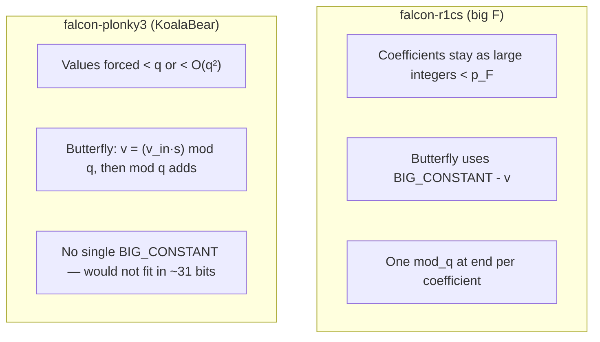

# falcon-plonky3

Plonky3 STARK scaffolding for Falcon signature verification (see [`falcon-rust`](../falcon-rust) for the lattice scheme and [`falcon-r1cs`](../falcon-r1cs/src/circuits/falcon_dual_ntt.rs) for the closest R1CS).

## Verifier-facing statement (Tier 1 trust model)

This section is the **single place** that states what the bundle **cryptographically** guarantees vs what the **verifier assumes** by re-running Falcon logic in Rust.

**Who must do what**

- **`prove_falcon_parsed_verify`** requires native [`PublicKey::verify_parsed_sig`](../falcon-rust/src/structs/pk.rs) first. That gates witness generation on the full parsed-verify path (hash, parsing, norm checks outside the STARKs as implemented today).
- **`verify_falcon_parsed_verify`** takes `(pk, msg, sig)` plus the proof bundle. It **does not** accept prover-supplied `pk_ntt` / `hm_ntt` blobs separately: it **rebuilds** every `Air` and periodic table from `(pk, msg, sig)` the same way as proving ([`build_falcon_dual_ntt_instance`](src/witness.rs), NTT preprocess for full NTT, etc.). A prover therefore **cannot** pick arbitrary periodic inputs and still pass verify.

**What each STARK binds (high level)**

| Sub-proof | Cryptographic content (relative to verifier-rebuilt parameters) |
|-----------|-------------------------------------------------------------------|
| Dual-NTT | Main trace satisfies the per-index mod-`q` congruence **given** periodic `pk_ntt[i]`, `hm_ntt[i]`; the first four main columns **equal** preprocessed reference NTT values for `sig_pos`, `sig_neg`, `v_pos`, `v_neg` at `i` (same derivation as native `NTTPolynomial` for those limbs). |
| Coeff dual-zero | Bit reconstructions **equal** preprocessed expected `sig_pos[i]`, `sig_neg[i]` from the signature, and **`sig_pos[i]·sig_neg[i]=0`**. |
| L² | Coefficient-domain centered square sum and `≤ SIG_L2_BOUND` (see [`FalconL2BoundAir`](src/air/l2_bound.rs)). |
| Four full NTTs | Forward NTT of the four polynomials derived from `(pk, msg, sig)` matches the preprocessed twiddle schedule for those polynomials. |

**Verifier assumption: `hm` and `hm_ntt`**

- Falcon’s hash-to-point produces **`hm`** from `(message, nonce)`; **`hm_ntt`** is its forward NTT. This crate’s API is built so the **verifier recomputes** `hm` / `hm_ntt` (and embeds them as periodic columns) when constructing the dual-NTT `Air` from `(pk, msg, sig)`—the same path as proving. The dual-NTT AIR **does not** contain a hash-to-point gadget; that is an explicit **design choice**: soundness relies on the verifier trusting **its own** Falcon hash + NTT implementation, not on the prover supplying `hm_ntt`.

**Cross-proof linking**

- The seven proofs still use **separate** Fiat–Shamir transcripts. What is new: within the **dual-NTT** proof, the NTT-domain limbs are **not** a free witness independent of `(pk, msg, sig)`—they are **pinned** to verifier-rebuilt preprocessed references. Likewise, **coeff dual-zero** pins the bit witness to expected coefficients from `sig`. Algebraic agreement between those references and the **full NTT butterfly** proofs is still by construction in this crate (same tuple rebuilds every `Air`); there is no single AIR wiring butterfly outputs into the dual trace.

## Trace layout (per row)

Rows are indexed by NTT coefficient $i = 0 \ldots N-1$ (with $N = 512$ or $1024$). One row = one NTT index.

### Public periodic columns (2 columns, period $N$)

[`FalconDualNttEquationAir`](src/air/dual_ntt_equation.rs) exposes **`pk_ntt[i]`** and **`hm_ntt[i]`** as **periodic** parameters (length-$N$ tables), not as a committed preprocessed trace. Both prover and verifier instantiate the same [`FalconDualNttEquationAir::new`](src/air/dual_ntt_equation.rs) data from `(pk, msg, sig)`; Plonky3’s STARK driver folds periodic data into the Fiat–Shamir transcript (see Plonky3 `uni-stark` prover). That **ties the dual-NTT proof** to those concrete periodic values **for this `Air` instance**—with this repo’s API, the values come from the verifier’s own derivation (see [Verifier-facing statement](#verifier-facing-statement-tier-1-trust-model)). The dual-NTT constraints still **do not** re-prove hash-to-point in-circuit; they use `hm_ntt` as given public data per row.

### Preprocessed columns (dual-NTT): 4 columns, height $N$

Committed **preprocessed** trace (verifier-rebuilt from `(pk, msg, sig)` the same way as proving): per row $i$, the expected NTT samples for **`sig_pos`**, **`sig_neg`**, **`v_pos`**, **`v_neg`** (KoalaBear-embedded residues mod $q$). The AIR requires equality with the first four **main** columns, so the dual-NTT witness cannot drift from the native `NTTPolynomial` values for those limbs under a verifier-constructed `Air`.

| Col | Name | Meaning |
|-----|------|---------|
| 0 | `exp_sig_pos_ntt` | Expected `sig_pos` NTT at index $i$ |
| 1 | `exp_sig_neg_ntt` | Expected `sig_neg` NTT at index $i$ |
| 2 | `exp_v_pos_ntt` | Expected `v_pos` NTT at index $i$ |
| 3 | `exp_v_neg_ntt` | Expected `v_neg` NTT at index $i$ |

| Col | Name     | Meaning |
|-----|----------|---------|
| 0   | `pk_ntt` | Public key polynomial in **NTT** form, coeff $i$ over $\mathbb{Z}_q$ |
| 1   | `hm_ntt` | Message-hash polynomial `hm` in **NTT** form, coeff $i$ |

### Main trace (36 columns)

Private witness per row. Coefficients are still **Falcon residues mod** `q = 12289`, embedded into KoalaBear for the STARK.

| Col(s) | Name | Meaning |
|--------|------|---------|
| 0–1 | `sig_pos_ntt`, `sig_neg_ntt` | Dual-limb NTT of signature polynomial (see dual path in [`verify_parsed_sig`](../falcon-rust/src/structs/pk.rs)) |
| 2–3 | `v_pos_ntt`, `v_neg_ntt` | Dual-limb NTT of $v = hm - s\cdot pk$ |
| 4–5 | `lhs_mod`, `rhs_mod` | Residues mod $q$ of the two sides of the dual-NTT congruence (must agree) |
| 6–7 | `prod_sig_pos_pk`, `prod_sig_neg_pk` | Integer products `sig_pos·pk` and `sig_neg·pk` (as integers $< q^2$), embedded in KoalaBear |
| 8–21 | `quot_l_bits[0..14]` | Little-endian bits of quotient `quot_l` in `sum_left = quot_l·q + lhs_mod` |
| 22–35 | `quot_r_bits[0..14]` | Bits for `quot_r` in `sum_right = quot_r·q + rhs_mod` |

### Diagram (one row)

```text
Periodic (public, period N)              Main (witness)
+----------------+                    +------------------------------------------+
| pk_ntt[i]      |                    | sig_pos_ntt  sig_neg_ntt             |
| hm_ntt[i]      |                    | v_pos_ntt    v_neg_ntt               |
+----------------+                    | lhs_mod      rhs_mod                 |
        |                             | prod_sp_pk   prod_sn_pk              |
        +------------------------------| quot_l_bits[14] quot_r_bits[14]      |
                                      +------------------------------------------+
```

Mermaid (dependency view for enforced identities):


## To tighten (statement binding)

**Tier 1** (explicit statement for integrators) is the [Verifier-facing statement](#verifier-facing-statement-tier-1-trust-model) section above: same `(pk, msg, sig)`, verifier-rebuilt periodic tables, preprocessed references where used, and a clear split between “proved by STARK” vs “assumed because the verifier re-runs Falcon logic in Rust” (including hash-to-point for `hm` / `hm_ntt`).

Checklist (optional refinements beyond the current design):

- [x] Bind `pk_ntt` and `hm_ntt` to the intended **public** values for the dual-NTT proof — done via **periodic columns** + shared [`FalconDualNttEquationAir`](src/air/dual_ntt_equation.rs) construction from `(pk, msg, sig)` in [`prove_falcon_parsed_verify`](src/full_verify.rs) / [`verify_falcon_parsed_verify`](src/full_verify.rs) (verifier does not trust prover-supplied periodic blobs).
- [x] Bind dual-NTT **NTT-domain** witness columns (`sig_*_ntt`, `v_*_ntt`) to verifier-native NTT values — **preprocessed** four-column reference trace + equality constraints in [`FalconDualNttEquationAir`](src/air/dual_ntt_equation.rs) ([`build_falcon_dual_ntt_instance`](src/witness.rs)); prove/verify use `setup_preprocessed` / `prove_with_preprocessed` / `verify_with_preprocessed` for that sub-proof.
- [x] Bind **coeff dual-zero** bit witness to expected **`sig_pos` / `sig_neg`** coefficients — **preprocessed** two-column reference + equality in [`FalconCoeffDualProductZeroAir`](src/air/coeff_dual_product_zero.rs) ([`build_falcon_coeff_dual_product_zero_instance`](src/witness.rs)).
- [ ] **Single proof or explicit FS composition:** connect [`FalconNttFullAir`](src/air/ntt_full.rs) butterfly traces to the same PCS / transcript as the dual-NTT proof (today: independent proofs; consistency is same `(pk, msg, sig)` rebuild plus the preprocessed equalities above). Optionally unify with **L²** in one AIR.

## NTT one layer at a time (`FalconNttLayerAir`)

Forward NTT in [`falcon_rust::ntt`](../falcon-rust/src/arith/mod.rs) runs `LOG_N` in-place Cooley–Tukey layers. For each **`layer ∈ [0, LOG_N)`**, [`FalconNttLayerAir`](src/air/ntt_layer.rs) proves **that layer’s** butterflies: trace height **`N/2`**, **preprocessed** width **1** (twiddle `s` per row from [`NTT_TABLE`](../falcon-rust/src/arith/param.rs)), main width **`6 · QUOT_BITS + 2`** (same bit layout as before: `u`, `v_in`, `v_mul`, `quot_vs`, `out0`, `out1`, `q0`, `q1`).

- API: [`build_ntt_layer_instance`](src/witness.rs) `(poly, layer)` → `(air, main_trace)`; [`build_ntt_layer0_trace`](src/witness.rs) is shorthand for `layer = 0` main trace only; [`FalconNttLayerAir::new_for_layer0`](src/air/ntt_layer.rs) builds the layer-0 preprocessed column (constant twiddle).
- [`FalconNttLayer0Air`](src/air/ntt_layer.rs) is a **type alias** for backward compatibility.
- Test: [`tests/ntt_layer_prove.rs`](tests/ntt_layer_prove.rs) runs prove/verify for **every** `layer`.

[`FalconNttFullAir`](src/air/ntt_full.rs) chains all `LOG_N` layers in **one** padded trace per polynomial limb (see [`tests/full_verify_prove.rs`](tests/full_verify_prove.rs) via [`full_verify`](src/full_verify.rs)).

**Still open for a single-proof R1CS-style verifier:** wiring [`FalconNttFullAir`](src/air/ntt_full.rs) into the **same** transcript / trace as the dual-NTT congruence (today the dual NTT limbs are **pinned** to native NTT via preprocessed equality, and full NTT is proved separately).

## Coefficient-domain dual limbs (`FalconCoeffDualProductZeroAir`)

A second AIR has one row per coefficient index $i$ and width **28** on the main trace:
14 little-endian bits for `sig_pos[i]` and 14 for `sig_neg[i]`. It enforces boolean bits,
**`sig_pos[i] * sig_neg[i] = 0`**, and **equality** of the reconstructed values to two
**preprocessed** columns holding the expected coefficients from the signature (verifier-rebuilt).

Implementation: [`src/air/coeff_dual_product_zero.rs`](src/air/coeff_dual_product_zero.rs), witness
[`build_falcon_coeff_dual_product_zero_instance`](src/witness.rs) (or [`build_falcon_coeff_dual_product_zero_trace`](src/witness.rs) for main only), test
[`tests/coeff_dual_zero_prove.rs`](tests/coeff_dual_zero_prove.rs).

This does **not** by itself connect coefficient limbs to **full NTT** butterfly internals; [`full_verify`](src/full_verify.rs) still relies on separate [`FalconNttFullAir`](src/air/ntt_full.rs) proofs plus the dual-NTT **preprocessed NTT reference** equalities for the NTT-domain side.

## What has been done

**End-to-end bundle:** [`prove_falcon_parsed_verify`](src/full_verify.rs) / [`verify_falcon_parsed_verify`](src/full_verify.rs) after native [`verify_parsed_sig`](../falcon-rust/src/structs/pk.rs) produce **seven** STARKs: dual-NTT congruence, coeff dual-zero, L² bound, and four full NTTs (`sig_pos`, `sig_neg`, `v_pos`, `v_neg`). See [`tests/full_verify_prove.rs`](tests/full_verify_prove.rs).

| Piece | Role |
|-------|------|
| [`FalconDualNttEquationAir`](src/air/dual_ntt_equation.rs) | Per NTT index $i$: NTT limbs pinned to preprocessed refs; dual-NTT congruence mod $q$ (enumerated below). |
| [`FalconCoeffDualProductZeroAir`](src/air/coeff_dual_product_zero.rs) | Coefficient domain: expected `sig_pos`/`sig_neg` in preprocessed columns; bits reconstruct and `sig_pos[i]·sig_neg[i]=0`. |
| [`FalconL2BoundAir`](src/air/l2_bound.rs) | Coefficient domain: centered `m²` sum and `≤ SIG_L2_BOUND`. |
| [`FalconNttLayerAir`](src/air/ntt_layer.rs) | One Cooley–Tukey layer (debug / per-layer tests). |
| [`FalconNttFullAir`](src/air/ntt_full.rs) | All `LOG_N` layers for one limb in one proof. |

**Per row $i$, [`FalconDualNttEquationAir`](src/air/dual_ntt_equation.rs) enforces:**

0. **Preprocessed reference:** `sig_pos_ntt`, `sig_neg_ntt`, `v_pos_ntt`, `v_neg_ntt` in the main trace **equal** the four preprocessed columns (verifier-native NTT at index $i$ for those limbs).
1. **`prod_sig_pos_pk = sig_pos_ntt · pk_ntt`** and **`prod_sig_neg_pk = sig_neg_ntt · pk_ntt`** with **KoalaBear multiplication** (sound because true products are $< q^2 < 2^{31}$).
2. **`sum_left = hm_ntt + v_neg_ntt + prod_sig_neg_pk`** and **`sum_right = v_pos_ntt + prod_sig_pos_pk`** (integer sums in the same small range).
3. **Euclidean division mod $q$** via `lhs_mod`, `quot_l` (bits), `rhs_mod`, `quot_r`: `sum_* - *_mod - quot_*·q = 0`, quotients **14-bit** booleans.
4. **`lhs_mod = rhs_mod`**.

This matches the **per-index congruence** in [`FalconDualNTTVerificationCircuit`](../falcon-r1cs/src/circuits/falcon_dual_ntt.rs). The **full NTT** proofs still justify the butterfly pipeline separately; a single AIR that merges them with the dual-NTT trace is not implemented yet (see checklist).

## Field sizes: KoalaBear vs BLS12-381 `Fr`

| Field | Typical size | Role in this repo |
|-------|----------------|-------------------|
| **KoalaBear** (Plonky3) | ~31-bit prime | STARK trace / constraints |
| **BLS12-381 scalar (`Fr`)** | ~256-bit | Groth16 / Arkworks (`falcon-r1cs` examples) |
| **Falcon modulus $q$** | `12289` | Coefficient ring $\mathbb{Z}_q$ |

**KoalaBear is vastly smaller than `Fr`**. That is **not** a problem for **embedding Falcon coefficients** ($< q$) or the **products** we use ($< q^2$): both fit comfortably below the KoalaBear prime, so those values behave like integers and **native KoalaBear `+` / `×`** match integer arithmetic **as long as** every intermediate you care about stays $< p_{\text{KoalaBear}}$.

### Why we cannot copy `falcon-r1cs` NTT verbatim (deferred reduction)

[`falcon-r1cs`](../falcon-r1cs/src/gadgets/poly.rs) implements the forward NTT with a **deferred modular-reduction** butterfly (same loop shape as [`falcon_rust::ntt`](../falcon-rust/src/arith/mod.rs), but different arithmetic). Roughly, for each layer it computes

```text
v        = (value at j+ht) × twiddle        -- full integer multiply, kept in the field F
neg_v    = BIG_CONSTANT - v                 -- subtraction in F
out[j]   = u + v
out[j+ht]= u + neg_v
```

with **`BIG_CONSTANT`** one of the wires **`const_vars[x-1] = 2^{x-1} · q^x`** for **`x = 1, …, LOG_N+1`** (see [`FalconDualNTTVerificationCircuit`](../falcon-r1cs/src/circuits/falcon_dual_ntt.rs): each term is `(1 << (x-1)) * MODULUS^x` in the field). Intuitively, the gadget keeps **unreduced** magnitude through the layers and only applies **`mod_q`** to each NTT coefficient **once at the end** ([`NTTPolyVar::ntt_circuit`](../falcon-r1cs/src/gadgets/poly.rs)).

**Core requirement:** every *true* integer that appears in that construction must be **strictly smaller** than the prime **`p_F`** of the proof field, and **`a + b`**, **`a × b`** in **`F`** must agree with **integer** `+` / `×` on those integers. Otherwise the circuit proves a relation **mod `p_F`**, not the integer relation you want.

So the R1CS code assumes something like **`q^{10} < p_F`** (comment in [`poly.rs`](../falcon-r1cs/src/gadgets/poly.rs)): the largest such constant is on the order of **`2^{LOG\_N} · q^{LOG\_N+1}`** (for Falcon-1024, **`LOG_N = 10`** → factor **`2^{10} · q^{11}`**).

**Concrete Falcon numbers** (`q = 12289`):

| Quantity | Rough size | Fits in KoalaBear? (`p \approx 2^{31}`) |
|----------|------------|----------------------------------------|
| `2 · q²` (early-layer-style constant) | `≈ 3.0 × 10⁸` | **Yes** |
| `2^{10} · q^{11}` (same family as last `const_vars` for `LOG_N = 10`) | **≈ 2^{160}** (≈ 48 decimal digits) | **No** — needs **~160 bits**, KoalaBear has **~31** |

So: the **early** layers’ constants could sit below `p_KoalaBear`, but **later** layers need integers vastly larger than `p_KoalaBear`. If you still embedded that constant in KoalaBear, you would only store **`BIG_CONSTANT mod p_KoalaBear`**, and **`BIG_CONSTANT - v`** would be the **wrong** integer unless `v` were also reduced mod `p` in a matching way — the algebra stops being the deferred-reduction NTT.

**Toy picture (same mechanism, tiny numbers):** Suppose you wanted integer **`C = 200`** in a relation **`C - v`**, but your field is **`F₁₀₁`** (prime **`p = 101`**). The machine only holds **`200 mod 101 = 99`**. If **`v = 3`** (integer), the **true** integer you care about is **`200 - 3 = 197`**, but the field computes **`99 - 3 = 96`**, and **`96 ≠ 197 mod 101`**. The gadget is proving the wrong statement. R1CS avoids this by choosing **`p_F` huge** so **`C`** and all intermediates **never wrap**.

**What `falcon-plonky3` does instead:** follow **[`falcon_rust::ntt`](../falcon-rust/src/arith/mod.rs)** — reduce **mod `q` after each multiply and each butterfly**, so values stay in **`[0, q)`**. Then all intermediates are **small** (sums/products bounded by **`O(q²)`** in the layers implemented so far), and KoalaBear arithmetic matches **integer** arithmetic on those values. The price is **more `mod q` steps in-circuit** (bit witnesses / quotients), not one big deferred pipeline.



## Falcon on Plonky3: concrete challenges (FAQ)

This section spells out *why* some `falcon-r1cs` patterns do not carry over unchanged, in terms of concrete arithmetic and soundness—not hand-waving about “small fields.”

### 1. Small base field (KoalaBear): what actually breaks?

KoalaBear is a ~31-bit prime field \(p \approx 2^{31}\). A trace cell holds **one residue mod \(p\)**, not an unbounded integer. Concrete issues:

| Issue | What goes wrong | Example / condition |
|--------|------------------|---------------------|
| **Modular wrap on `+` / `×`** | If you intend integer \(a+b\) or \(a\cdot b\) but the true integer exceeds \(p\), the field stores the value **mod \(p\)**. Constraints that only check **field** equality then prove the wrong **integer** statement. | Any accumulator that could exceed \(p\) without explicit limb/carry/range checks. |
| **Embedding huge constants** | The deferred-NTT gadget uses integers like \(2^{LOG\_N}\, q^{LOG\_N+1}\) (hundreds of bits for Falcon-1024). In KoalaBear you only have **`C mod p`**, not `C`. Every identity that uses `C` as an **integer** (e.g. `C - v`) becomes false in general. | See the table under *“Why we cannot copy falcon-r1cs NTT verbatim”* above: \(\approx 2^{160}\) vs \(\approx 2^{31}\). |
| **Sound comparisons / “≤”** | Proving `x ≤ B` as integers needs witnesses (bits, differences) so a cheating prover cannot use **wraparound** to make a field equation look like a true inequality. | L² accumulation: see below. |
| **What still works without redesign** | Values provably **always** \(< p\) and closed under the ops you use (e.g. products \(< q^2 < p\), sums of a few such terms) behave like integers. | Dual-NTT row: `sig_ntt·pk_ntt`, small quotients, etc., as implemented in [`FalconDualNttEquationAir`](src/air/dual_ntt_equation.rs). |

### 2. Deferred NTT (`falcon-r1cs`) vs per-layer \(\bmod q\) (`falcon_rust` / this repo)—more detail

**Native Falcon / `falcon_rust::ntt`:** each butterfly works in \(\mathbb{Z}_q\): multiply by a twiddle, **reduce mod \(q\)**, add/subtract, **reduce again**. All lane values stay in \([0,q)\) (or a small envelope). The NTT is correct **in the ring** \(\mathbb{Z}_q[X]/(X^N+1)\).

**`falcon-r1cs` deferred NTT:** the implementation keeps **larger intermediate integers inside the R1CS field** \(\mathbb{F}\) (e.g. BLS12-381 scalar, \(\sim 2^{256}\)). A butterfly step uses a **large** `BIG_CONSTANT` (a power-of-two multiple of a power of \(q\)) so that `BIG_CONSTANT - v` simulates a signed lift **without** reducing \(v\) mod \(q\) at every layer. Only **after** all layers does the gadget apply **`mod_q`** per coefficient. For that to be **sound**, every *true* integer used in those butterflies—including `BIG_CONSTANT` and intermediate sums—must be **\(< |\mathbb{F}^\times|\)** so that field operations match integer operations.

**Why that does not port to KoalaBear:** for later layers, `BIG_CONSTANT` is enormous (see table: \(\sim 2^{160}\) for Falcon-1024). You **cannot** store that integer in a KoalaBear cell; you store `BIG_CONSTANT mod p`, and the subtraction `BIG_CONSTANT - v` in the field is **not** the integer subtraction you wanted. The whole deferred-reduction algebra assumes “one big prime, no wrap.”

**What Plonky3 does instead:** follow **`falcon_rust`-style** butterflies: **each** step proves modular multiplication (`v_in·s = v_mul + quot·q`) and modular additions with small quotient bits. That is **more steps and more witness columns**, but every quantity fits under \(p\) and field arithmetic matches integer arithmetic on the values you care about.

### 3. One combined AIR: why quotient and trace shape matter

There is no mathematical obstruction to putting NTT, dual-NTT, coeff checks, and L² in **one** AIR. What makes that a serious engineering step is how STARKs pay for constraints:

- **Constraint degree:** the highest degree among all AIR identities (after selectors) drives the **quotient** polynomial degree and hence FRI/PCS work. Stacking NTT butterflies (already multiplicative degree several), per-row dual-NTT identities, bit lookups, and L² accumulation in one constraint set often **raises** that maximum compared to separate AIRs tuned in isolation.
- **Single trace geometry:** today’s pieces use different natural heights (`N` for the congruence AIR, \((N/2)\cdot LOG_N\) padded for full NTT, `4N` for L², etc.). One matrix means **padding**, **selector columns** to turn constraints off on inactive rows, or a custom layout—each choice affects width, degree, and soundness bookkeeping.
- **Prover cost:** work scales roughly with trace size (width × height) and with the quotient pipeline derived from degree. A unified trace can be **wider and/or taller** than the sum of minimal separate traces if you are not careful.

### 4. L²: why not “one big field variable” for the running sum?

In `falcon-r1cs`, the norm is accumulated in a single `FpVar` over a **huge** field: intermediate partial sums for a valid signature stay tiny compared to the modulus, so **`acc + x²` in \(\mathbb{F}\)** equals **integer** `acc + x²` with no wrap. No extra machinery.

In KoalaBear:

- The **final** L² value is \(\le \texttt{SIG\_L2\_BOUND}\) (\(\sim 10^7\)–\(10^8\)), well below \(p\).
- But the **constraint** must rule out a **malicious** trace where the prover uses field addition so that the stored “accumulator” wraps mod \(p\) while still satisfying some loose equations.

So you need an encoding where addition is **integer addition on bounded witnesses**: e.g. boolean bits for the running sum, transition rows `acc_next = acc_cur + contrib`, and a final `acc + slack = SIG_L2_BOUND`, plus bit decomposition for `e < q` and centered magnitude (see [`FalconL2BoundAir`](src/air/l2_bound.rs)). That is the same *soundness* issue as any small-field accumulator, not “L² is too big for KoalaBear.”

### Dilithium (ML-DSA): concrete circuit pain points

Dilithium will be implemented in this workspace as well; the bullets below are **concrete costs** tied to the ML-DSA verification formula (useful for Falcon readers comparing verifier shape).

- **Hashing (SHAKE-256 / SHAKE-128):** the signing and verification APIs are built around XOF output. Implementing SHAKE **inside** a SNARK/STARK is thousands to millions of constraints per absorbed block; many designs **hash outside** the proof and bind the digest as a public input, or use a proof-system-specific hash gadget if the statement must be fully in-circuit.
- **Decomposition / hints:** coefficients are split into high and low parts (`t0`, `t1`, powers-of-2 ranges, hint vectors) with **explicit inequalities** and range checks—same *class* of work as Falcon’s quotients and L², but over different moduli (`q`, \(\gamma_1\), etc.) and larger witness vectors.
- **Linear algebra mod \(q\):** matrix–vector products and additions in \(\mathbb{Z}_q\) are many bounded products and sums; on a **small** proof field you still need “no wrap” or limb logic wherever an intermediate can exceed the native prime.
- **Scale:** parameter sets use larger structured matrices than a minimal Falcon instance—**trace width and row count** tend to grow, which hits prover time even when individual ops are simple.

### R1CS / Groth16 (`falcon-r1cs`)

Arkworks **R1CS constraint counts** (e.g. `ConstraintSystem::num_constraints()` for `FalconNTTVerificationCircuit`, `FalconDualNTTVerificationCircuit`, schoolbook verify) are documented in [`falcon-r1cs`](../falcon-r1cs/README.md) and in more detail in [`falcon-r1cs/docs/r1cs_constraints.md`](../falcon-r1cs/docs/r1cs_constraints.md). At Falcon-1024, NTT-based verification is on the order of **\(10^5\)** R1CS rows versus **on the order of \(10^6\)** primitive AIR identities for the seven-proof Plonky3 bundle here—the metrics are **not** interchangeable.

## Running tests

```bash
RUSTFLAGS="-C target-cpu=native" cargo test -p falcon-plonky3 --release
```
