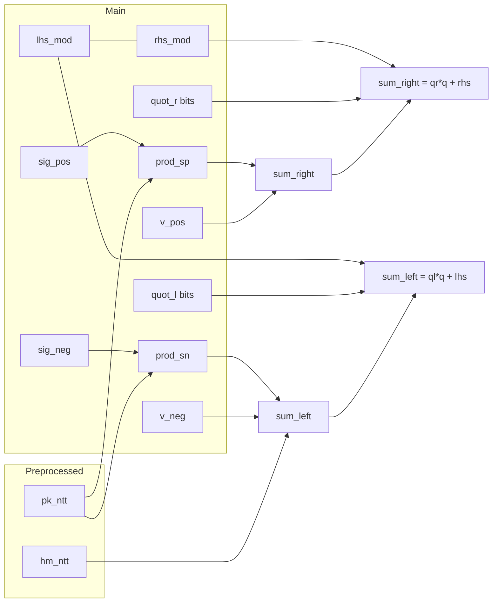

# falcon-plonky3

Plonky3 STARK scaffolding for Falcon signature verification (see [`falcon-rust`](../falcon-rust) for the lattice scheme and [`falcon-r1cs`](../falcon-r1cs/src/circuits/falcon_dual_ntt.rs) for the closest R1CS).

## Trace layout (per row)

Rows are indexed by NTT coefficient $i = 0 \ldots N-1$ (with $N = 512$ or $1024$). One row = one NTT index.

### Preprocessed trace (2 columns)

Committed once per statement; intended to correspond to **public** Falcon data (same role as `pk_ntt` / `hm_ntt` inputs in Groth16 examples).

| Col | Name     | Meaning |
|-----|----------|---------|
| 0   | `pk_ntt` | Public key polynomial in **NTT** form, coeff $i$ over $\mathbb{Z}_q$ |
| 1   | `hm_ntt` | Message-hash polynomial `hm` in **NTT** form, coeff $i$ |

### Main trace (36 columns)

Private witness per row. Coefficients are still **Falcon residues mod** `q = 12289`, embedded into KoalaBear for the STARK.

| Col(s) | Name | Meaning |
|--------|------|---------|
| 0–1 | `sig_pos_ntt`, `sig_neg_ntt` | Dual-limb NTT of signature polynomial (see dual path in [`verify_parsed_sig`](../falcon-rust/src/structs/pk.rs)) |
| 2–3 | `v_pos_ntt`, `v_neg_ntt` | Dual-limb NTT of $v = hm - s\cdot pk$ |
| 4–5 | `lhs_mod`, `rhs_mod` | Residues mod $q$ of the two sides of the dual-NTT congruence (must agree) |
| 6–7 | `prod_sig_pos_pk`, `prod_sig_neg_pk` | Integer products `sig_pos·pk` and `sig_neg·pk` (as integers $< q^2$), embedded in KoalaBear |
| 8–21 | `quot_l_bits[0..14]` | Little-endian bits of quotient `quot_l` in `sum_left = quot_l·q + lhs_mod` |
| 22–35 | `quot_r_bits[0..14]` | Bits for `quot_r` in `sum_right = quot_r·q + rhs_mod` |

### Diagram (one row)

```text
Preprocessed                          Main (witness)
+----------------+                    +------------------------------------------+
| pk_ntt[i]      |                    | sig_pos_ntt  sig_neg_ntt             |
| hm_ntt[i]      |                    | v_pos_ntt    v_neg_ntt               |
+----------------+                    | lhs_mod      rhs_mod                 |
        |                             | prod_sp_pk   prod_sn_pk              |
        +------------------------------| quot_l_bits[14] quot_r_bits[14]      |
                                      +------------------------------------------+
```

Mermaid (dependency view for enforced identities):



## To tighten (message hash and public inputs)

The **message hash** `hm` must be part of the verified statement: a verifier must know that the `hm_ntt` used in the proof is the one obtained from **(message, nonce)** under Falcon’s hash-to-point routine. In `falcon-r1cs` / `falcon-plonk`, `hm_ntt` is effectively **public** (Groth16 public inputs or Plonk public wires). In `falcon-plonky3` today, `hm_ntt` lives in the **preprocessed trace**; the AIR uses it in constraints but **does not yet** bind it to an external public digest the way a production verifier would (e.g. hash `hm_ntt` into Fiat–Shamir, or expose coefficients as explicit public values).

Checklist for a “complete” statement:

- [ ] Bind `pk_ntt` and `hm_ntt` to **public inputs** (or a binding commitment opened in-proof).
- [ ] Optionally prove **hash-to-point** in-circuit if `hm` must be derived from raw `message` inside the proof (expensive; often the statement fixes `hm_ntt` as public).
- [ ] Finish **NTT consistency**, **dual `pos·neg = 0`** (coefficient domain), and **norm / range** checks to match `falcon-r1cs` / `falcon-plonk`.

## Numeric toy example (one NTT index)

Take Falcon modulus $q = 12289$. All values below are **one coefficient** $i$ in the NTT domain (not a full signature).

**Chosen values**

| Symbol | Value | Role |
|--------|------:|------|
| `pk_ntt[i]` | 1000 | From preprocessed |
| `hm_ntt[i]` | 100 | From preprocessed |
| `sig_neg_ntt[i]` | 10 | Witness |
| `v_neg_ntt[i]` | 50 | Witness |
| `sig_pos_ntt[i]` | 50 | Witness |
| `v_pos_ntt[i]` | 80000 | Witness |

**Products (main trace cols 6–7)**

- `prod_sig_neg_pk = 10 × 1000 = 10000`
- `prod_sig_pos_pk = 50 × 1000 = 50000`

**Sums**

- `sum_left = hm + v_neg + prod_sig_neg_pk = 100 + 50 + 10000 = 10150`
- `sum_right = v_pos + prod_sig_pos_pk = 80000 + 50000 = 130000`

These were picked only to illustrate **quotient bits**; for a real signature row, `lhs_mod` and `rhs_mod` would match because the witness is built from a valid Falcon tuple. Here is a **consistent** right-hand split with the **same remainder** as `sum_left`:

Adjust so both sides share the same residue mod $q$: e.g. `sum_left = sum_right = 130000`:

- `sum_left = 100 + 50 + (10 × 1000) = 10150` — too small. Instead use a coherent example:

**Revised coherent example** (both sums equal 130000, same remainder 7110):

- `pk = 1000`, `hm = 100`, `v_neg = 50`, `sig_neg = 124` → `prod_sn = 124000`, `sum_left = 100 + 50 + 124000 = 124150`
- Still not 130000. Simpler path: set `sum_left = sum_right = 25000`:
  - `pk=100`, `sig_neg=50`, `v_neg=10`, `hm=100` → `prod_sn=5000`, `sum_left=100+10+5000=5110`
  
Simplest clean demo with **nonzero quotient**:

- $q = 12289$
- `sum_left = 130000`
- `quot_l = floor(130000 / 12289) = 10`
- `lhs_mod = 130000 - 10 × 12289 = 130000 - 122890 = 7110`

Take the **same** `sum_right = 130000` so `quot_r = 10`, `rhs_mod = 7110`. The trace would then witness `sig`, `v`, `pk`, `hm` that produce these sums; the AIR checks the algebra and `lhs_mod == rhs_mod`.

The **14-bit `quot_*` columns** are exactly the bit decomposition of `quot_l` and `quot_r` (here `10 = 0b1010` in the low bits, rest zero).

## What is proved today

For each row $i$, the AIR enforces:

1. **`prod_sig_pos_pk = sig_pos_ntt · pk_ntt`** and **`prod_sig_neg_pk = sig_neg_ntt · pk_ntt`** using **KoalaBear multiplication** (sound here because true products are $< q^2 < 2^{31}$ and lie below the KoalaBear prime, so they agree with integer multiplication).
2. **`sum_left = hm_ntt + v_neg_ntt + prod_sig_neg_pk`** and **`sum_right = v_pos_ntt + prod_sig_pos_pk`** (integer sums, same bound).
3. **Euclidean division mod $q$** via witnesses `lhs_mod`, `quot_l` (from bits), `rhs_mod`, `quot_r`:
   - `sum_left - lhs_mod - quot_l·q = 0`
   - `sum_right - rhs_mod - quot_r·q = 0`
   with `quot_l`, `quot_r` each **14-bit** (boolean bit constraints).
4. **`lhs_mod = rhs_mod`**.

This matches the **per-index congruence** proved in [`FalconDualNTTVerificationCircuit`](../falcon-r1cs/src/circuits/falcon_dual_ntt.rs) (modulo the R1CS `mod_q` gadget encoding), **without** yet proving:

- NTT layers (`sig_ntt` / `v_ntt` are correct NTTs of coefficient-domain limbs),
- dual feasibility `pos·neg = 0` in the **coefficient** domain,
- Falcon **norm / range** bounds.

## Field sizes: KoalaBear vs BLS12-381 `Fr`

| Field | Typical size | Role in this repo |
|-------|----------------|-------------------|
| **KoalaBear** (Plonky3) | ~31-bit prime | STARK trace / constraints |
| **BLS12-381 scalar (`Fr`)** | ~256-bit | Groth16 / Arkworks (`falcon-r1cs` examples) |
| **Falcon modulus $q$** | `12289` | Coefficient ring $\mathbb{Z}_q$ |

Yes — **KoalaBear is vastly smaller than `Fr`**. That is **not** a problem for **embedding Falcon coefficients** ($< q$) or the **products** we use ($< q^2$): both fit comfortably below the KoalaBear prime, so those values behave like integers and **native KoalaBear `+` / `×`** match integer arithmetic **as long as** every intermediate you care about stays $< p_{\text{KoalaBear}}$.

What **would** be wrong is to confuse **“multiply in KoalaBear”** with **“multiply in $\mathbb{Z}_q$”** for *general* formulas; we only use KoalaBear `×` where the **integer product** is provably small enough to avoid modular wraparound, and we route modular reduction through **explicit $q$-division identities** with bounded quotients.

## Running tests

```bash
RUSTFLAGS="-C target-cpu=native" cargo test -p falcon-plonky3 --release
```
